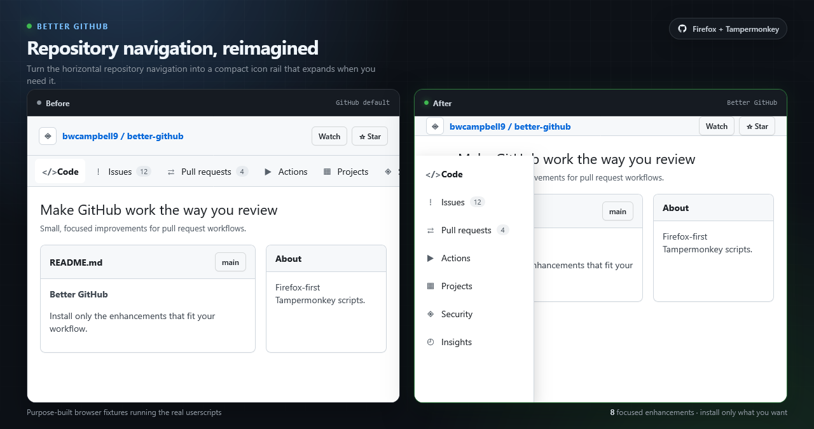
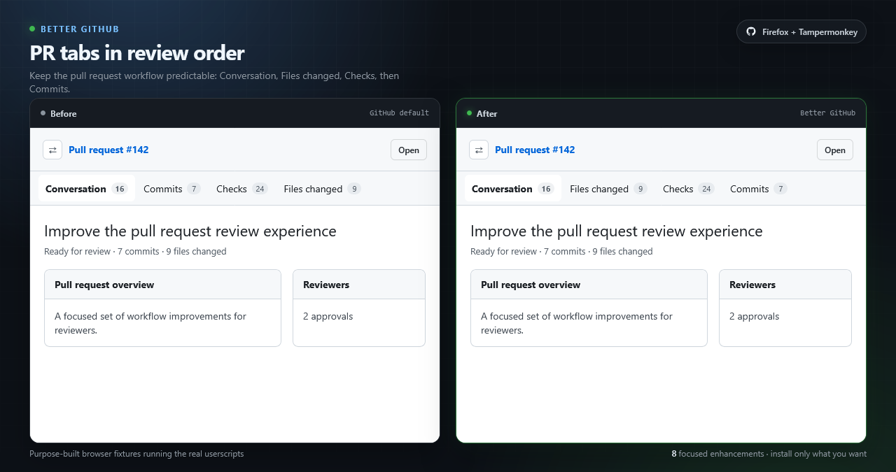
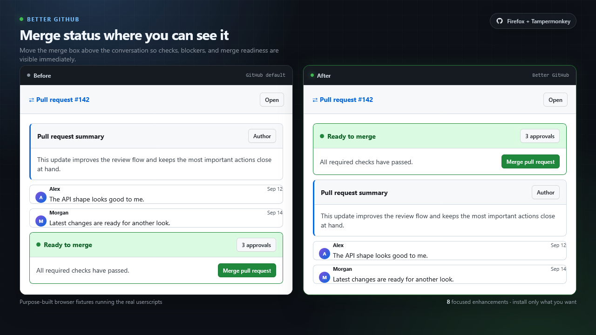
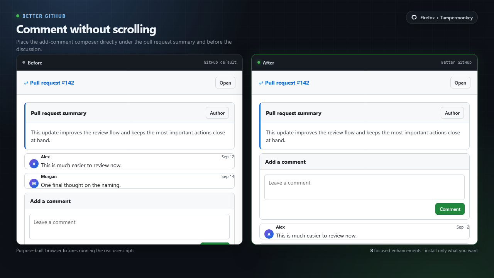
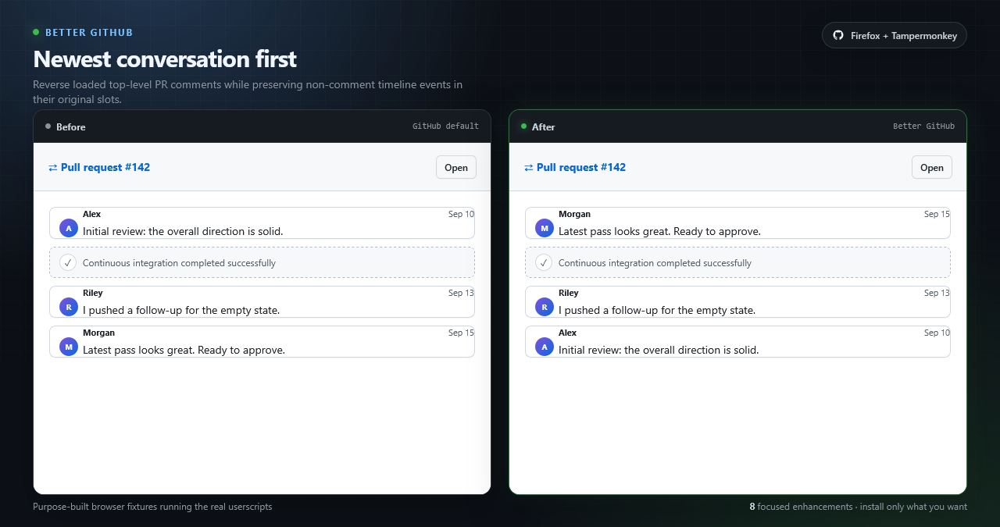
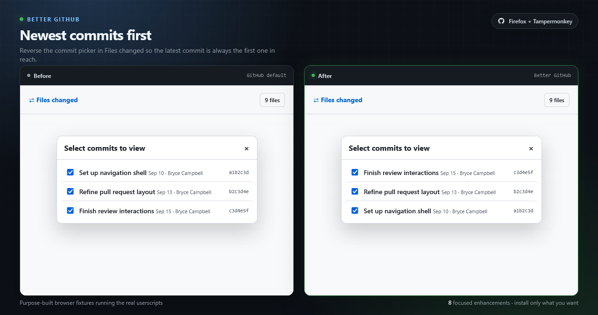
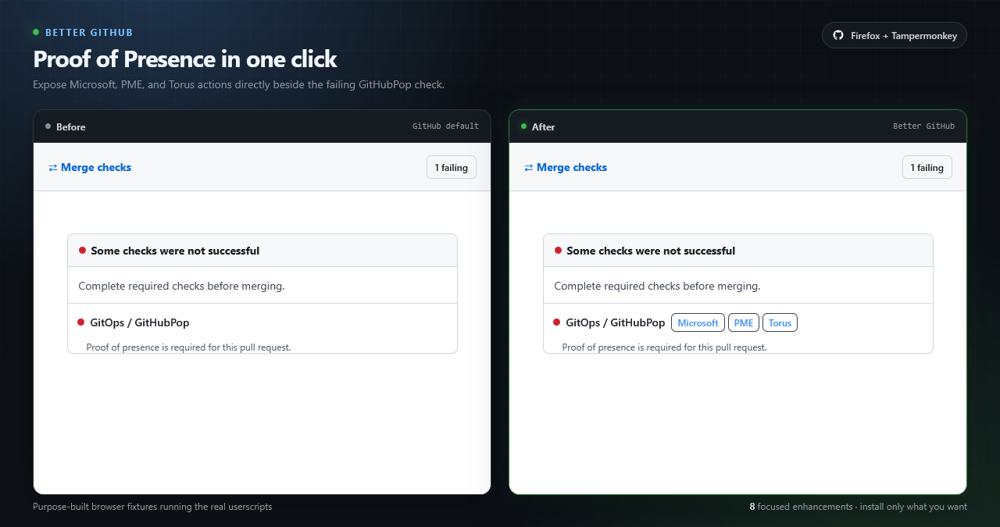
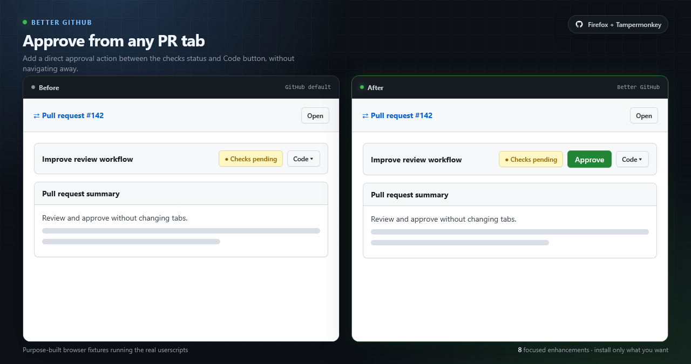

<h1>Better GitHub</h1>

  <strong>
    Small, focused Tampermonkey scripts that make GitHub pull requests faster
    to navigate and easier to review.
  </strong>

  
  
  
  

  Install only the enhancements you want. Every feature is an independent
  userscript and can be enabled, disabled, updated, or removed on its own.

> [!IMPORTANT]
> **These scripts have only been tested in Firefox with Tampermonkey.**
> Chrome, Edge, Safari, and other userscript managers are currently untested.

## Why Better GitHub?

GitHub's pull request interface is powerful, but the most useful information
and actions are not always where a reviewer needs them. Better GitHub makes
small, deliberate changes instead of replacing the interface:

- Keep repository navigation accessible without consuming a full horizontal
  row.
- Put PR tabs, comments, commits, merge state, and review actions in a more
  useful order.
- Work consistently across GitHub.com and GitHub Enterprise endpoints under
  `*.ghe.com`.
- Preserve GitHub's normal authentication and authorization behavior.

The scripts watch for GitHub's dynamic page updates and reapply their changes
without requiring a refresh.

## Installation

1. Install
   [Tampermonkey for Firefox](https://addons.mozilla.org/firefox/addon/tampermonkey/).
2. Click an **Install** link in the table below.
3. Review the source in Tampermonkey, then select **Install**.
4. Reload the GitHub page.

Each script includes update metadata, so Tampermonkey can retrieve future
versions from this repository.

The userscripts request access only to `github.com` and `*.ghe.com`. They also
verify GitHub-specific page metadata before running feature logic.

## Quick install

| Feature | What changes | Install |
|---|---|---|
| [Repository Side Rail](#1-repository-side-rail) | Moves repository navigation to an expandable icon rail | [**Install**](https://raw.githubusercontent.com/bwcampbell9/better-github/refs/heads/users/brycampbell/main/scripts/01-repository-side-rail.user.js) |
| [PR Tab Order](#2-pull-request-tab-order) | Orders tabs as Conversation, Files changed, Checks, Commits | [**Install**](https://raw.githubusercontent.com/bwcampbell9/better-github/refs/heads/users/brycampbell/main/scripts/02-pr-tab-order.user.js) |
| [Merge Box First](#3-merge-box-first) | Moves merge readiness above the conversation | [**Install**](https://raw.githubusercontent.com/bwcampbell9/better-github/refs/heads/users/brycampbell/main/scripts/03-merge-box-first.user.js) |
| [Comment Box After Summary](#4-comment-box-after-the-pr-summary) | Places the comment composer directly below the PR summary | [**Install**](https://raw.githubusercontent.com/bwcampbell9/better-github/refs/heads/users/brycampbell/main/scripts/04-comment-box-after-summary.user.js) |
| [Newest Comments First](#5-newest-comments-first) | Shows the latest loaded PR comments first | [**Install**](https://raw.githubusercontent.com/bwcampbell9/better-github/refs/heads/users/brycampbell/main/scripts/05-newest-comments-first.user.js) |
| [Newest Commits First](#6-newest-commits-first) | Reverses the Files changed commit picker | [**Install**](https://raw.githubusercontent.com/bwcampbell9/better-github/refs/heads/users/brycampbell/main/scripts/06-newest-commits-first.user.js) |
| [Merge Box Check Actions](#7-merge-box-check-actions) | Adds quick actions to a supported check | [**Install**](https://raw.githubusercontent.com/bwcampbell9/better-github/refs/heads/users/brycampbell/main/scripts/07-pop-links-in-merge-box.user.js) |
| [Direct Approve Button](#8-direct-approve-button) | Approves a PR from any tab without opening the review dialog | [**Install**](https://raw.githubusercontent.com/bwcampbell9/better-github/refs/heads/users/brycampbell/main/scripts/08-direct-approve-button.user.js) |

## Feature details

### 1. Repository Side Rail

[**Install userscript**](https://raw.githubusercontent.com/bwcampbell9/better-github/refs/heads/users/brycampbell/main/scripts/01-repository-side-rail.user.js)
·
[View source](scripts/01-repository-side-rail.user.js)

Moves GitHub's horizontal repository navigation into a fixed rail on the left
side of the page.

- Uses a compact 48-pixel icon rail during normal browsing.
- Expands to show navigation labels when hovered.
- Keeps responsive navigation items visible in the rail.
- Shifts the main page content so the collapsed rail does not cover it.
- Leaves GitHub's mobile layout unchanged below 768 pixels.

### 2. Pull Request Tab Order

[**Install userscript**](https://raw.githubusercontent.com/bwcampbell9/better-github/refs/heads/users/brycampbell/main/scripts/02-pr-tab-order.user.js)
·
[View source](scripts/02-pr-tab-order.user.js)

Reorders the pull request tabs around the way a review normally flows:

**Conversation → Files changed → Checks → Commits**

It supports both `/files` and `/changes` routes used by GitHub.com and
different GitHub Enterprise Server releases, and it restores the order after
GitHub rerenders the tab bar.

### 3. Merge Box First

[**Install userscript**](https://raw.githubusercontent.com/bwcampbell9/better-github/refs/heads/users/brycampbell/main/scripts/03-merge-box-first.user.js)
·
[View source](scripts/03-merge-box-first.user.js)

Moves the complete merge box to the top of the PR conversation timeline. Check
status, policy failures, approvals, merge conflicts, and the merge action are
visible before the discussion instead of after it.

### 4. Comment Box After the PR Summary

[**Install userscript**](https://raw.githubusercontent.com/bwcampbell9/better-github/refs/heads/users/brycampbell/main/scripts/04-comment-box-after-summary.user.js)
·
[View source](scripts/04-comment-box-after-summary.user.js)

Moves GitHub's complete **Add a comment** section directly below the original
PR description and above the existing conversation. The normal editor,
preview, attachments, saved replies, and submit behavior stay intact because
the script relocates GitHub's form instead of recreating it.

### 5. Newest Comments First

[**Install userscript**](https://raw.githubusercontent.com/bwcampbell9/better-github/refs/heads/users/brycampbell/main/scripts/05-newest-comments-first.user.js)
·
[View source](scripts/05-newest-comments-first.user.js)

Sorts loaded top-level PR comments by timestamp so the latest conversation is
at the top.

- Non-comment timeline events remain in their existing slots.
- Nested review threads are not flattened.
- Newly rendered comments are automatically included.
- The sort is stable when comments have the same timestamp.

### 6. Newest Commits First

[**Install userscript**](https://raw.githubusercontent.com/bwcampbell9/better-github/refs/heads/users/brycampbell/main/scripts/06-newest-commits-first.user.js)
·
[View source](scripts/06-newest-commits-first.user.js)

Reverses the commit order in the **Select commits to view** picker on the Files
changed tab.

The script supports both GitHub's classic link-based picker and the newer
checkbox-based dialog. It records the original commit positions and applies a
stable newest-first order even when the picker is rerendered.

### 7. Merge Box Check Actions

[**Install userscript**](https://raw.githubusercontent.com/bwcampbell9/better-github/refs/heads/users/brycampbell/main/scripts/07-pop-links-in-merge-box.user.js)
·
[View source](scripts/07-pop-links-in-merge-box.user.js)

Adds quick action links beside a supported pull request check. It remains
inactive when that check is not present.

### 8. Direct Approve Button

[**Install userscript**](https://raw.githubusercontent.com/bwcampbell9/better-github/refs/heads/users/brycampbell/main/scripts/08-direct-approve-button.user.js)
·
[View source](scripts/08-direct-approve-button.user.js)

Adds a green **Approve** button between the PR checks status and **Code**
button on every pull request tab.

- Does not navigate to Files changed.
- Does not open GitHub's review dialog.
- Does not require or store a personal access token.
- Fetches GitHub's authenticated review form in the background and submits an
  approval with GitHub's normal CSRF and head-SHA fields.
- Shows progress, success, permission, self-approval, and expired-session
  states.

This is intentionally a one-click action. GitHub still enforces all normal
permissions, including the rule that authors cannot approve their own pull
requests.

## Browser support

| Environment | Status |
|---|---|
| Firefox + Tampermonkey | **Tested** |
| Chrome / Edge + Tampermonkey | Untested |
| Safari | Untested |
| Other userscript managers | Untested |

The scripts support `https://github.com/*` and GitHub Enterprise endpoints
matching `https://*.ghe.com/*`. They detect GitHub-specific page metadata at
runtime before modifying the document. GitHub frequently changes its page
structure, so a future UI update may require selector changes.

## Privacy and security

- No script sends telemetry.
- No script reads or stores a personal access token.
- The Direct Approve feature uses the existing authenticated, same-origin
  GitHub browser session.
- Scripts make no background cross-origin network requests.
- The source for every installed script is visible in this repository and in
  Tampermonkey.

## Combining features

The scripts are designed to run independently and can also be enabled
together. Their DOM updates are idempotent, and each feature observes GitHub's
dynamic rerenders without intentionally duplicating UI.

If GitHub changes a relevant element and a feature stops working, open an
[issue](https://github.com/bwcampbell9/better-github/issues) with:

- The affected script.
- The GitHub.com or `*.ghe.com` page type.
- A screenshot of the current UI.
- Any errors shown in the Firefox developer console.

## License

[MIT](LICENSE)
